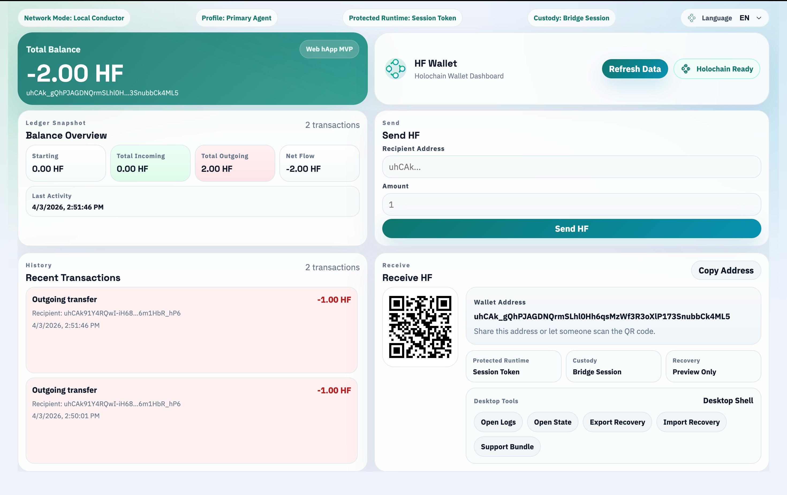
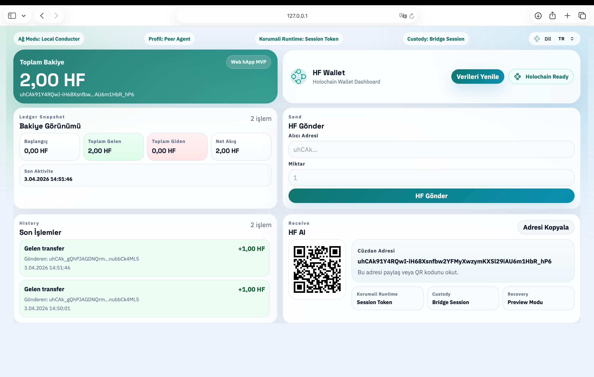
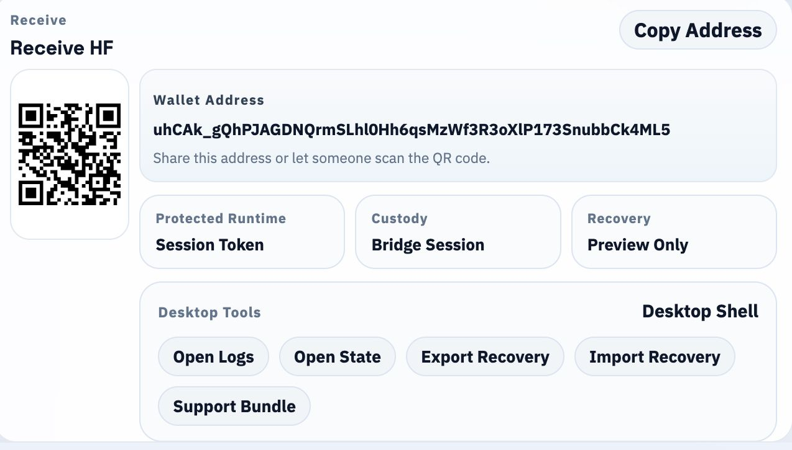
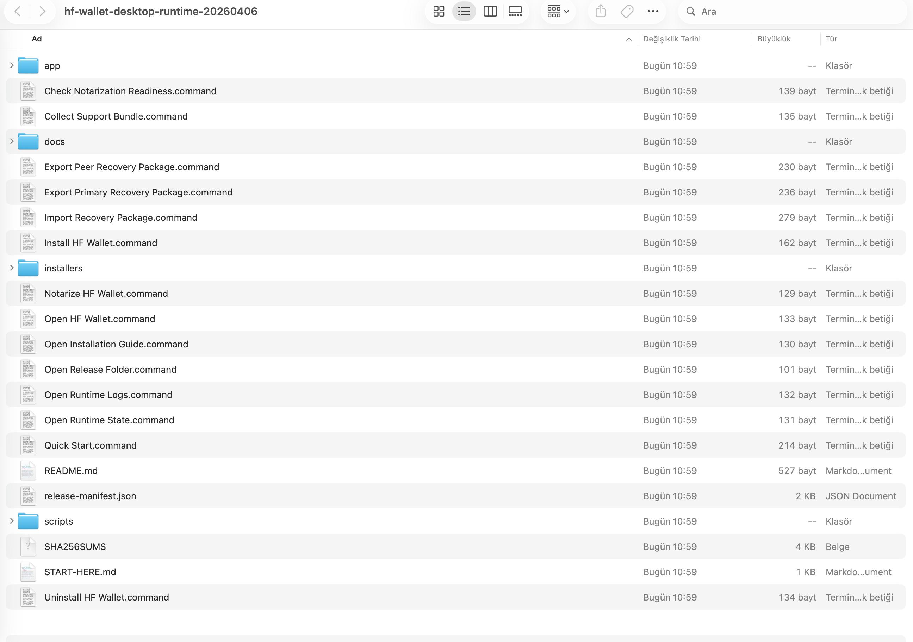
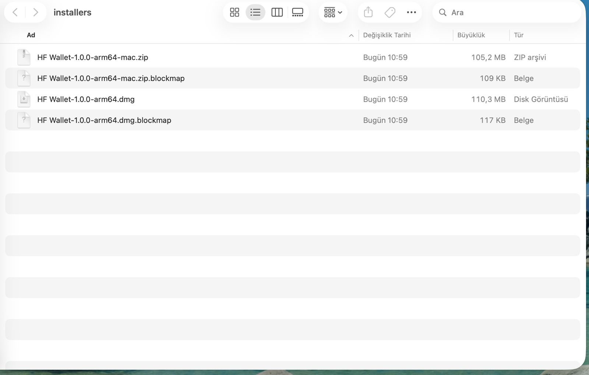
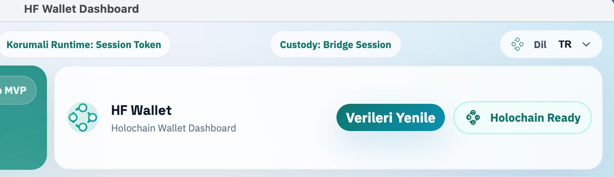

# Holo Fuel Wallet

Holo Fuel Wallet is a Holochain-native wallet product candidate focused on a future HoloFuel-ready user experience.

This public repository is a **showcase repo**. It is designed to help the Holochain and HoloFuel ecosystem quickly understand what has already been built, without exposing the private working source repository.

## What This Showcase Proves

- working wallet dashboard
- primary and peer wallet profiles
- verified multi-conductor transfer flow
- receive flow with QR and wallet address
- desktop runtime direction
- multilingual interface support

## Why This Matters

The hardest part of a future HoloFuel wallet is not only token connectivity.
It is also:

- wallet UX
- runtime behavior
- recovery model
- desktop distribution
- multi-agent visibility

This showcase demonstrates that those foundations are already moving beyond concept stage.

## Product Positioning

Holo Fuel Wallet is a Holochain-native wallet platform candidate with verified multi-conductor transfer proof.

It is **not** presented as:

- an official production HoloFuel wallet
- a finished custody product
- a final security-audited release

It **is** presented as:

- a serious product candidate
- a Holochain-native wallet foundation
- a future HoloFuel-ready direction

## Quick Highlights

- Single-screen wallet dashboard
- Verified transfer visibility across separate conductors
- Desktop runtime direction with packaged app flow
- QR-based receive flow
- English, Turkish, Chinese, Russian, and Arabic interface support

## Demo Assets

### Demo Video

- [Desktop demo video](video/hf-wallet-desktop-demo-20260406.mp4)

### Screenshots

#### Primary Dashboard

#### Peer Profile

#### Receive Flow

#### Desktop Runtime Release

#### Installer Outputs

#### Language Switching

See also:

- [Press Kit Notes](PRESS-KIT.md)
- [Usage Notice](NOTICE.md)

## What Is Public And What Is Not

This repository intentionally includes:

- screenshots
- demo video
- product-facing description
- ecosystem-facing visibility material

This repository intentionally does **not** include:

- the private working source repository
- local runtime state
- recovery exports
- private release automation details

## Feedback

If this direction looks useful for the ecosystem, feedback is welcome through GitHub issues or discussions.
